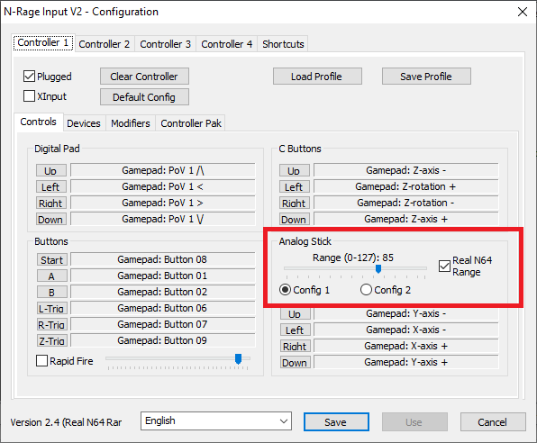

## NRage_Input_V2.4 (Real N64 Range fix)

 

This is a small change to the NRage Input Plugin V2.4.

As soon in the screenshot above, the range slider has been changed from 0-100 to 0-127. 
This allows for slightly better range resolution. The default is 85 as that is about what 
a brand new OEM N64 controller would have.

The main reason for this version is to fix the Real N64 Range calculation. The Real N64 Range option
is supposed to make your controllers values be more like a real N64 controller where the diagonals
have slightly less range than straight up/down/left/right. The calculation in the official plugin is
too short and this version fixes it.

With max range (127) straight up/down/left/right you should get 127 and at diagonal notches you should get about 104.
With recommend values you should get 85 straight up/down/left/right and 70 at the diagonal notches.

Turning on Real N64 Range is only recommended if you use this version and if at diagonal notches you are getting about 
the same values of straight up/down/left/right.

You can check your stick values in Usamune. In Usamune options go to HUD->INPUT and set that to ONVAL.
https://sites.google.com/view/supermario64/usamunepj/usamunerom

## Download
https://github.com/Dackage353/nrage-input-realvaluefix/releases